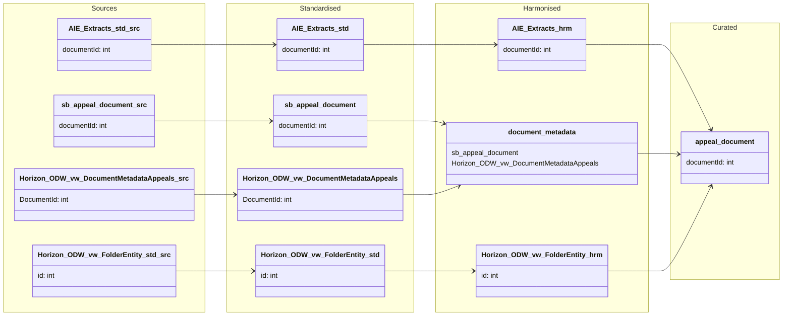

#### ODW Data Model

##### entity: appeal-document

Data model for appeal-document entity showing data flow from source to curated.

```mermaid

classDiagram

    direction LR

    namespace Sources {

        class sb_appeal_document_src {
            documentId: int
        }

        class Horizon_ODW_vw_DocumentMetadataAppeals_src {
            DocumentId: int
        }

        class AIE_Extracts_std_src {
            documentId: int
        }

        class Horizon_ODW_vw_FolderEntity_std_src {
            id: int
        }

    }
    
    namespace Standardised {

        class sb_appeal_document {
            documentId: int
        }

        class Horizon_ODW_vw_DocumentMetadataAppeals {
            DocumentId: int
        }

        class AIE_Extracts_std {
            documentId: int
        }

        class Horizon_ODW_vw_FolderEntity_std {
            id: int
        }
    }

    namespace Harmonised {

        class AIE_Extracts_hrm {
            documentId: int
        }

        class document_metadata {
            sb_appeal_document
            Horizon_ODW_vw_DocumentMetadataAppeals
        }

        class Horizon_ODW_vw_FolderEntity_hrm {
            id: int
        }
    }

    namespace Curated {

        class appeal_document {
            documentId: int
        }
    }

`sb_appeal_document_src` --> `sb_appeal_document`
`Horizon_ODW_vw_DocumentMetadataAppeals_src` --> `Horizon_ODW_vw_DocumentMetadataAppeals`
`AIE_Extracts_std_src` --> `AIE_Extracts_std`
`Horizon_ODW_vw_FolderEntity_std_src` --> `Horizon_ODW_vw_FolderEntity_std`
`sb_appeal_document` --> `document_metadata`
`Horizon_ODW_vw_DocumentMetadataAppeals` --> `document_metadata`
`AIE_Extracts_std` --> `AIE_Extracts_hrm`
`Horizon_ODW_vw_FolderEntity_std` --> `Horizon_ODW_vw_FolderEntity_hrm`
`AIE_Extracts_hrm` --> `appeal_document`
`document_metadata` --> `appeal_document`
`Horizon_ODW_vw_FolderEntity_hrm` --> `appeal_document`


```