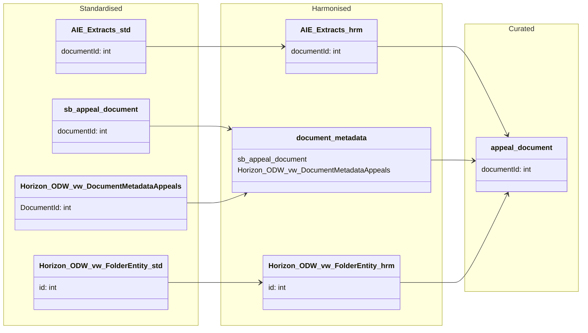

#### ODW Data Model

##### appeal-document

```mermaid

classDiagram

    direction LR

    namespace Standardised {

        class sb_appeal_document {
            documentId: int
        }

        class Horizon_ODW_vw_DocumentMetadataAppeals {
            DocumentId: int
        }

        class AIE_Extracts_std {
            documentId: int
        }

        class Horizon_ODW_vw_FolderEntity_std {
            id: int
        }
    }

    namespace Harmonised {

        class AIE_Extracts_hrm {
            documentId: int
        }

        class document_metadata {
            sb_appeal_document
            Horizon_ODW_vw_DocumentMetadataAppeals
        }

        class Horizon_ODW_vw_FolderEntity_hrm {
            id: int
        }
    }

    namespace Curated {

        class appeal_document {
            documentId: int
        }
    }

`sb_appeal_document` --> `document_metadata`
`Horizon_ODW_vw_DocumentMetadataAppeals` --> `document_metadata`
`AIE_Extracts_std` --> `AIE_Extracts_hrm`
`Horizon_ODW_vw_FolderEntity_std` --> `Horizon_ODW_vw_FolderEntity_hrm`
`AIE_Extracts_hrm` --> `appeal_document`
`document_metadata` --> `appeal_document`
`Horizon_ODW_vw_FolderEntity_hrm` --> `appeal_document`


```