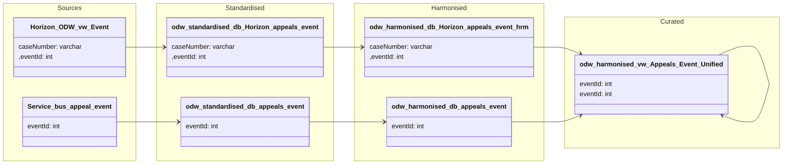

#### ODW Data Model

##### entity: appeal-event

Data model for appeal-event entity showing data flow from source to curated.

```mermaid

classDiagram

    direction LR

    namespace Sources {

        class Horizon_ODW_vw_Event {
            caseNumber: varchar
            ,eventId: int
        }

        class Service_bus_appeal_event  {
            eventId: int
        }
    }

    namespace Standardised {

        class odw_standardised_db_Horizon_appeals_event {
            caseNumber: varchar
            ,eventId: int
        }

        class odw_standardised_db_appeals_event  {
            eventId: int
        }
    }

    namespace Harmonised {

        class odw_harmonised_db_Horizon_appeals_event_hrm {
            caseNumber: varchar
            ,eventId: int
        }

        class odw_harmonised_db_appeals_event  {
            eventId: int
        }

        class odw_harmonised_vw_Appeals_Event_Unified  {
            eventId: int
        }
    }

    namespace Curated {

        class odw_harmonised_vw_Appeals_Event_Unified {
            eventId: int
        }
    }

`Horizon_ODW_vw_Event` --> `odw_standardised_db_Horizon_appeals_event`
`Service_bus_appeal_event` --> `odw_standardised_db_appeals_event`

`odw_standardised_db_Horizon_appeals_event` --> `odw_harmonised_db_Horizon_appeals_event_hrm` 
`odw_standardised_db_appeals_event` --> `odw_harmonised_db_appeals_event`


`odw_harmonised_db_Horizon_appeals_event_hrm` --> `odw_harmonised_vw_Appeals_Event_Unified`
`odw_harmonised_db_appeals_event` --> `odw_harmonised_vw_Appeals_Event_Unified`
`odw_harmonised_vw_Appeals_Event_Unified` --> `odw_harmonised_vw_Appeals_Event_Unified`

```