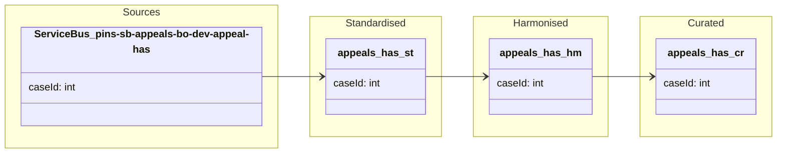

#### ODW Data Model

##### entity: appeal-has

Data model for appeal-has entity showing Service Bus data flow from source to curated.

```mermaid

classDiagram

    direction LR

    namespace Sources {

        class ServiceBus_pins-sb-appeals-bo-dev-appeal-has {
            caseId: int
        }

    }
    
    namespace Standardised {

        class appeals_has_st {
            caseId: int
        }
    }

    namespace Harmonised {

        class appeals_has_hm {
            caseId: int
        }

    }

    namespace Curated {

        class appeals_has_cr {
            caseId: int
        }

    }

`ServiceBus_pins-sb-appeals-bo-dev-appeal-has` --> `appeals_has_st`
`appeals_has_st` --> `appeals_has_hm`
`appeals_has_hm` --> `appeals_has_cr`


```
