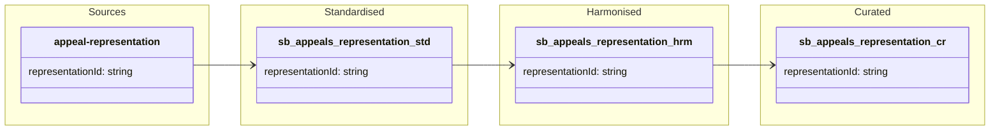

#### ODW Data Model

##### entity: appeal-representation

Data model for appeal-representation entity showing Service Bus data flow from source to curated.

```mermaid

classDiagram

    direction LR

    namespace Sources {

        class appeal-representation {
            representationId: string
        }

    }
    
    namespace Standardised {

        class sb_appeals_representation_std {
            representationId: string
        }
    }

    namespace Harmonised {

        class sb_appeals_representation_hrm {
            representationId: string
        }

    }

    namespace Curated {

        class sb_appeals_representation_cr {
            representationId: string
        }

    }

`appeal-representation` --> `sb_appeals_representation_std`
`sb_appeals_representation_std` --> `sb_appeals_representation_hrm`
`sb_appeals_representation_hrm` --> `sb_appeals_representation_cr`


```
