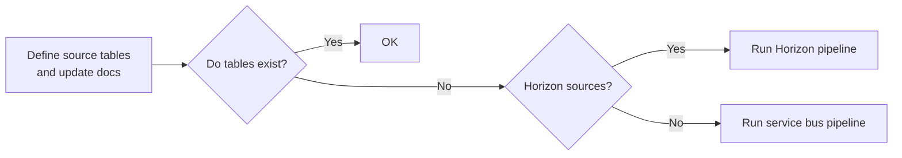

```mermaid

flowchart LR
    A[Define source tables
    and update docs] --> B{Do tables exist?}
    B -- Yes --> C[OK]
    B -- No ----> D{Horizon sources?}
    D -- Yes ---> E[Run Horizon pipeline]
    D -- No ---> F[Run service bus pipeline]

```