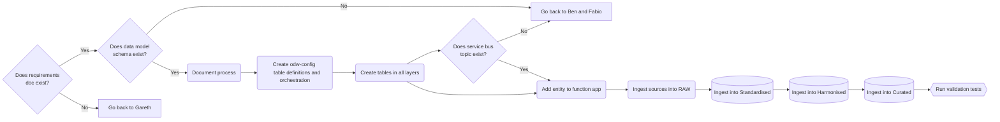

# Process flow for all entities

**NB: Some things can be done in parallel if all information is available**  
 

```mermaid

flowchart LR

    A{Does requirements 
    doc exist?}
    B{Does data model 
    schema exist?}
    A-- Yes --> B
    A-- No --> GH[Go back to Gareth]
    B-- No --> BJ[Go back to Ben and Fabio]
    B-- Yes --> C(Document process)
    C --> D(Create odw-config 
    table definitions and orchestration)
    D --> E(Create tables in all layers)
    E --> SB{Does service bus 
    topic exist?}
    SB-- Yes --> FA
    SB-- No --> BJ
    E --> FA(Add entity to function app)
    FA --> F(Ingest sources into RAW)
    F --> G[(Ingest into Standardised)]
    G --> H[(Ingest into Harmonised)]
    H --> I[(Ingest into Curated)]
    I --> J{{Run validation tests}}


```