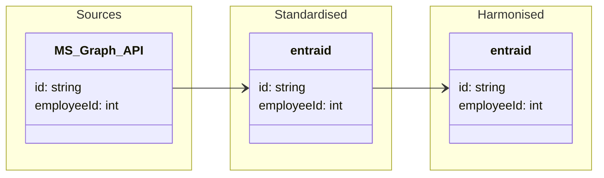

#### ODW Data Model

##### entity: entraid-users

Data model for entraid data flow from source to harmonised.

```mermaid

classDiagram

    direction LR

    namespace Sources {

        class MS_Graph_API {
            id: string
            employeeId: int
        }

    }
    
    namespace Standardised {

        class entraid_std ["entraid"] {
            id: string
            employeeId: int
        }
    }

    namespace Harmonised {

        class entraid_hrm ["entraid"]{
            id: string
            employeeId: int
        }
    }

`MS_Graph_API` --> `entraid_std`
`entraid_std` --> `entraid_hrm`
```
