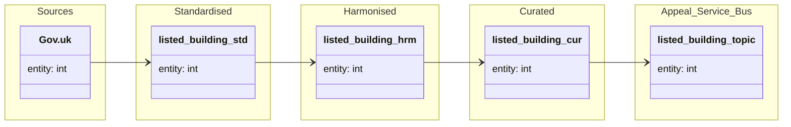

#### ODW Data Model

##### entity: listed-building

Data model for listed-building entity showing Service Bus data flow from source to the service bus.

```mermaid

classDiagram

    direction LR

    namespace Sources {

        class Gov.uk {
            entity: int
        }

    }
    
    namespace Standardised {

        class listed_building_std {
            entity: int
        }
    }

    namespace Harmonised {

        class listed_building_hrm {
            entity: int
        }

    }

    namespace Curated {

        class listed_building_cur {
            entity: int
        }

    }

    namespace Appeal_Service_Bus {

        class listed_building_topic {
            entity: int
        }

    }

`Gov.uk` --> `listed_building_std`
`listed_building_std` --> `listed_building_hrm`
`listed_building_hrm` --> `listed_building_cur`
`listed_building_cur` --> `listed_building_topic`

```
