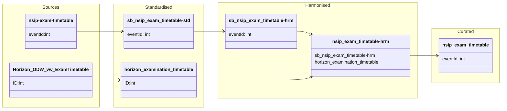

#### ODW Data Model

##### entity: nsip-exam-timetable

Data model for nsip-exam-timetable entity showing data flow from source to curated.

```mermaid

classDiagram

    direction LR

    namespace Sources {

        class Horizon_ODW_vw_ExamTimetable {
            ID:int
        }

        class nsip-exam-timetable{
            eventId:int
        }


    }
    
    namespace Standardised {

        class horizon_examination_timetable {
             ID:int
        }

        class sb_nsip_exam_timetable-std {
            eventId: int
        }

    }

    namespace Harmonised {

        class nsip_exam_timetable-hrm {
            sb_nsip_exam_timetable-hrm 
            horizon_examination_timetable
        }

        class sb_nsip_exam_timetable-hrm {
            eventId: int
        }
    
    }

    namespace Curated {

        class nsip_exam_timetable {
            eventId: int
        }
    }


`nsip-exam-timetable` --> `sb_nsip_exam_timetable-std`
`sb_nsip_exam_timetable-std` --> `sb_nsip_exam_timetable-hrm`
`sb_nsip_exam_timetable-hrm` --> `nsip_exam_timetable-hrm`
`nsip_exam_timetable-hrm` --> `nsip_exam_timetable`

`Horizon_ODW_vw_ExamTimetable` --> `horizon_examination_timetable`
`horizon_examination_timetable` --> `nsip_exam_timetable-hrm`

```