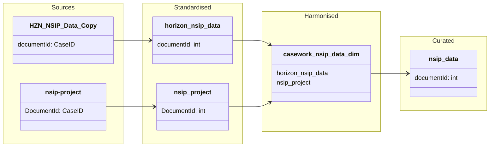

#### ODW Data Model

##### entity: nsip-project

Data model for nsip-project entity showing data flow from source to curated.

```mermaid

classDiagram

    direction LR

    namespace Sources {

        class HZN_NSIP_Data_Copy {
            documentId: CaseID
        }

        class nsip-project {
            DocumentId: CaseID
        }


    }
    
    namespace Standardised {

        class horizon_nsip_data {
            documentId: int
        }

        class nsip_project {
            DocumentId: int
        }

    }

    namespace Harmonised {


        class casework_nsip_data_dim {
            horizon_nsip_data
            nsip_project
        }

    }

    namespace Curated {

        class nsip_data {
            documentId: int
        }
    }


`HZN_NSIP_Data_Copy` --> `horizon_nsip_data`
`nsip-project` -->`nsip_project`

`horizon_nsip_data` --> `casework_nsip_data_dim`

`nsip_project`--> `casework_nsip_data_dim`

`casework_nsip_data_dim` --> `nsip_data`

```