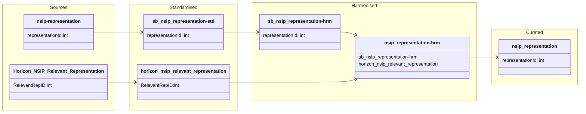

#### ODW Data Model

##### entity: nsip-representation

Data model for nsip-representation entity showing data flow from source to curated.

```mermaid

classDiagram

    direction LR

    namespace Sources {

        class Horizon_NSIP_Relevant_Representation {
            RelevantRepID:int
        }

        class nsip-representation{
            representationId:int
        }


    }
    
    namespace Standardised {

        class horizon_nsip_relevant_representation {
             RelevantRepID:int
        }

        class sb_nsip_representation-std {
            representationId: int
        }

    }

    namespace Harmonised {

        class nsip_representation-hrm {
            sb_nsip_representation-hrm 
            horizon_nsip_relevant_representation
        }

        class sb_nsip_representation-hrm {
            representationId: int
        }
    
    }

    namespace Curated {

        class nsip_representation {
            representationId: int
        }
    }


`nsip-representation` --> `sb_nsip_representation-std`
`sb_nsip_representation-std` --> `sb_nsip_representation-hrm`
`sb_nsip_representation-hrm` --> `nsip_representation-hrm`
`nsip_representation-hrm` --> `nsip_representation`

`Horizon_NSIP_Relevant_Representation` --> `horizon_nsip_relevant_representation`
`horizon_nsip_relevant_representation` --> `nsip_representation-hrm`

```