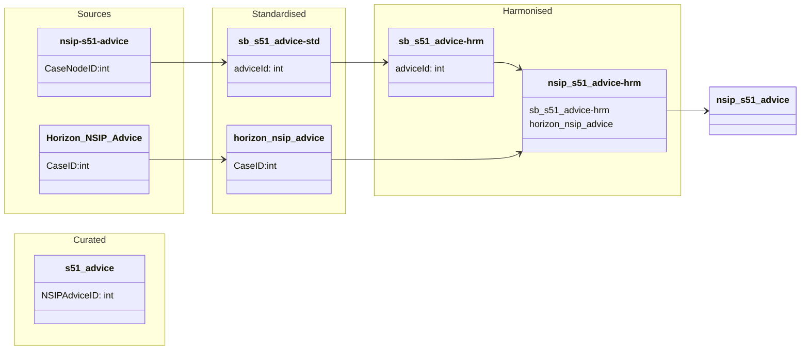

#### ODW Data Model

##### entity: nsip-s51-advice

Data model for nsip-s51-advice entity showing data flow from source to curated.

```mermaid

classDiagram

    direction LR

    namespace Sources {

        class Horizon_NSIP_Advice {
            CaseID:int
        }

        class nsip-s51-advice{
            CaseNodeID:int
        }


    }
    
    namespace Standardised {

        class horizon_nsip_advice {
             CaseID:int
        }

        class sb_s51_advice-std {
            adviceId: int
        }

    }

    namespace Harmonised {

        class nsip_s51_advice-hrm {
            sb_s51_advice-hrm 
            horizon_nsip_advice
        }

        class sb_s51_advice-hrm {
            adviceId: int
        }
    
    }

    namespace Curated {

        class s51_advice {
            NSIPAdviceID: int
        }
    }


`nsip-s51-advice` --> `sb_s51_advice-std`
`sb_s51_advice-std` --> `sb_s51_advice-hrm`
`sb_s51_advice-hrm` --> `nsip_s51_advice-hrm`
`nsip_s51_advice-hrm` --> `nsip_s51_advice`

`Horizon_NSIP_Advice` --> `horizon_nsip_advice`
`horizon_nsip_advice` --> `nsip_s51_advice-hrm`

```
