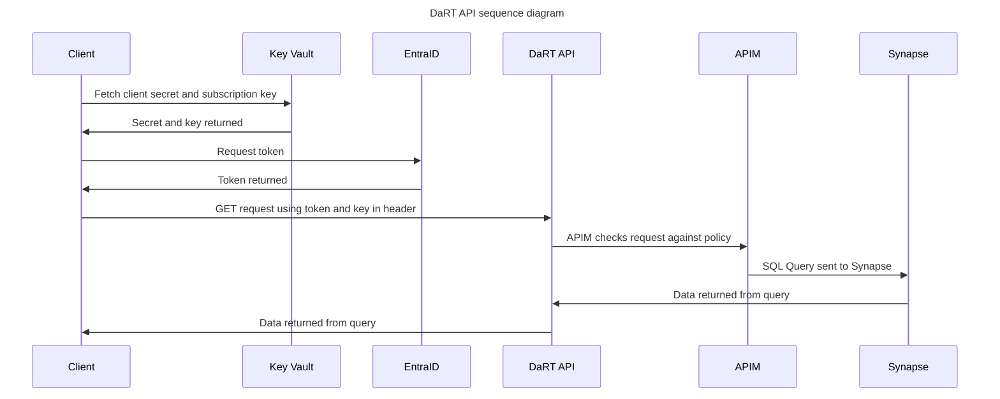

# Documentation of the use of API Management (APIM) and Function Apps with ODW  

[High level architecture](#high-level-architecture)  
[Service User process](#service-user-process)  
[DaRT process](#dart-process)  
[Folder structure example](#folder-structure-example)  
[Authorisation flow](#authorisation-flow)  
[Timesheet API](#timesheet-api)

## High level architecture  

  

## Key points to note

- All Function Apps will be on a Premium plan (e.g. EP1) to allow VNET integration
- All Function Apps will use the same App Service Plan
- A system assigned managed identity will be created for each Function App
- All Function Apps will be imported into API Management (APIM) service for security
- APIs will be organised into logical products within APIM
- Subscription keys will be required for all APIs
- oAuth will also be used to authenticate against each API
- APIM will be integrated with Azure Entra ID
- The APIM developer portal will be used to access API documentation and to subscribe to APIs
- A JWT validate policy will be applied to all APIs as part of auth flow
- Azure Key Vault will be used to store subscription keys and service principal secrets used to call the APIs
- Subscription keys and SPN secrets to be rotated on a regular basis (tbc) using Azure DevOps pipeline
- Clients to fetch keys as needed from Key Vault (key rotation process to be finalised and tested)

## Service User process  
### Goal
Back Office (ODT) wants to send and receive data from ODW via Service Buses. 

### Process
The end-to-end process has been automated as follows.

1. An **Azure Function** will be triggerred whenever the Back Office sends a new message to their **Service bus**. This message is expected to be in json format.
2. **Azure Function** will write this data as a json blob in a **Storage Account** at `odw-raw/Service-Bus/Service-User/{rand-guid}.json`.
3. A Storage Event trigger `tr_odw_raw_service_user` will be fired as a result of this write operation which then will trigger a **Synapse Pipeline** `pln_service_user_main`.
4. This pipeline will process and ingest the new data in Standardised, Harmonised, and Curated layers within the ODW and as a final step, publish the data the ODW **Service Bus** at `service-user` topic.
5. In addition to the new data coming from the Back Office, ODW will also process/host legacy Service User data obtained from **Horizon**. This data is originally present at `odw-raw/Horizon/2023-05-19/CaseInvolvement.csv`.
6. Back Office will be able to subscribe to this topic and consume the processed data.
7. For other entities like NSIP, we will be able to re-use the above process.

### Service User architecture  


### Key notes
- Make sure the Function App and the Storage Account are in the same VNET to allow communication.
- Make sure that the Azure Data Factory application (search Azure Data Factory in managed identities when doing a role assignment) has the right role assigned (EventGrid EventSubscription Contributor) in the Subscription to be able to publish the trigger.

## DaRT process  

 - Managed identity is created for DaRT Function App
 - Managed identity is granted read access to relevant objects in Synapse that it needs to query. This can be done within Synapse itself, e.g.  

 ```sql
-- create a login first for the managed identity
use master;
create login [pins-dart-app] from external provider;
print 'login created'

-- create a user on the required database (or multiple)
use odw_curated_db;
create user [pins-dart-app] for login [pins-dart-app];
print 'user created';

-- add the user to a role
ALTER ROLE db_datareader
ADD MEMBER [pins-dart-app];
print 'user added to role';
 ``` 
- Managed identity need read access to files in the storage account container holding the data. E.g. for the odw_curated_db it would be **pinsstodwdevuks9h80mb/odw_curated** with permission role assignment of **Storage Blob Data Reader**  
- The DaRT app is based on an http trigger with a SQL binding.  
    1. Client makes GET request to endpoint
    2. Function App receives request and sends SQL query to Synapse
    3. Synapse returns response in json format for client to consume

The app code will look something like this, using python v2 programming model. The SQL query can be held in a separate file ease of management; this is just an initial example.   

```python

import azure.functions as func
import logging
from azure.functions.decorators.core import DataType
import json

app = func.FunctionApp()

@app.function_name(name="GetCases")
@app.route(route="getcases", methods=["get"], auth_level=func.AuthLevel.FUNCTION)

@app.generic_input_binding(arg_name="cases", type="sql",
                        CommandText="SELECT TOP (10) * FROM [odw_harmonised_db].[dbo].[casework_case_info_dim]",
                        CommandType="Text",
                        ConnectionStringSetting="SqlConnectionString",
                        data_type=DataType.STRING)

def get_cases(req: func.HttpRequest, cases: func.SqlRowList) -> func.HttpResponse:
    rows = list(map(lambda r: json.loads(r.to_json()), cases))

    return func.HttpResponse(
        json.dumps(rows),
        status_code=200,
        mimetype="application/json"
    )
```

 ## Folder structure example

Function App code and required files should be placed in a folder structure as follows, within the ODW-Service repo root folder.  

Terraform can then reference the required files to create the Function Apps. 

```bash

functions:.
├───DaRT
│       .funcignore
│       dart_query.sql
│       function_app.py
│       host.json
│       local.settings.json
│       requirements.txt
│
├───ODT
└───Service_User
```

## Authorisation flow  
#### Example shown for DaRT but very similar for other APIs  




# Timesheet API
### Goal
Back Office (ODT) wants to read data from ODW. An API needs to be provided which reads data from specified SQL tables and returns it to the calling process.

### Process

To simply things, the code exists within the service bus functions **functions/function_app.py** file. This makes deploying and maintaining it easier

```python
@_app.function_name(name="gettimesheets")
@_app.route(route="gettimesheets", methods=["get"], auth_level=func.AuthLevel.FUNCTION)
@_app.sql_input(arg_name="timesheet",
                command_text="SELECT [caseReference], [applicationReference], [siteAddressLine1], [siteAddressLine2], [siteAddressTown], [siteAddressCounty], [siteAddressPostcode] FROM [odw_curated_db].[dbo].[appeal_has] WHERE UPPER([caseReference]) LIKE Concat(Char(37), UPPER(@searchCriteria), Char(37)) OR UPPER([applicationReference]) LIKE Concat(Char(37), UPPER(@searchCriteria), Char(37)) OR UPPER([siteAddressLine1]) LIKE Concat(Char(37), UPPER(@searchCriteria), Char(37)) OR UPPER([siteAddressLine2]) LIKE Concat(Char(37), UPPER(@searchCriteria), Char(37)) OR UPPER([siteAddressTown]) LIKE Concat(Char(37), UPPER(@searchCriteria), Char(37)) OR UPPER([siteAddressCounty]) LIKE Concat(Char(37), UPPER(@searchCriteria), Char(37)) OR UPPER([siteAddressPostcode]) LIKE Concat(Char(37), UPPER(@searchCriteria), Char(37))",
                command_type="Text",
                parameters="@searchCriteria={searchCriteria}",
                connection_string_setting="SqlConnectionString")
def gettimesheets(req: func.HttpRequest, timesheet: func.SqlRowList) -> func.HttpResponse:
    """
    We need to use Char(37) to escape the % 
    https://stackoverflow.com/questions/71914897/how-do-i-use-sql-like-value-operator-with-azure-functions-sql-binding
    """
    try:
        rows = list(map(lambda r: json.loads(r.to_json()), timesheet))
        return func.HttpResponse(
            json.dumps(rows),
            status_code=200,
            mimetype="application/json"
        )
    except Exception as e:
        return (
            func.HttpResponse(f"Unknown error: {str(e)}", status_code=500)
        )
``` 

This function exposes an endpoint which can be called from external applications.

The URL looks a little like this:

```https://<FUNCTION_APP_URL>/api/gettimesheets?code=<ACCESS_TOKEN>==&searchCriteria=<SEARCH CRITERIA>```

```<SEARCH_CRITERIA>``` is expected to be a free text string which is resolved to ```%<SEARCH_CRITERIA>%``` internally and searches across the following columns. The sql_input decorator handles SQL injection protection.

```
[caseReference],
[applicationReference],
[siteAddressLine1],
[siteAddressLine2],
[siteAddressTown],
[siteAddressCounty],
[siteAddressPostcode]
```

CORS headers are returned which means that Web UIs from other origins can access the API.

#### Notes

For now, we use the LIKE and UPPER operands to give a wildcard search. You cannot combine the % operand and the @searchCriteria parameter so we have to work around it by uaing a CONCAT and the Char(37) (which is %) to reproduce this functionality.


To make use of the **sql_input** declarator (which is defined here 
[here](https://learn.microsoft.com/en-us/azure/azure-functions/functions-bindings-azure-sql-input?tabs=isolated-process%2Cnodejs-v4%2Cpython-v2&pivots=programming-language-python)), the requirements.txt has needed to be updated to use a later version of ***azure-functions***
```
azure-identity==1.15.0
azure-functions==1.20.0
azure-servicebus==7.11.4
azure-storage-blob==12.19.0
azure-mgmt-web==7.2.0
azure-keyvault==4.2.0
PyYAML==6.0.1
jsonschema==4.20.0
iso8601==2.1.0
aiohttp==3.9.4
pytest==7.4.0
pytest-asyncio==0.23.3
git+https://github.com/Planning-Inspectorate/data-model@main#egg=pins_data_model
```
If the previous version 1.17.0 was used then the functions app deployed but zero functions were available with no apparent logging as to the cause.

### Functionality
This function simply  makes a query to the curated table [odw_curated_db].[dbo].[s62a] which surfaces the required data. The function app needs to have the right permissions to make these queries which uses a SqlConnectionString variable in the function app configuration

```SqlConnectionString: Server=tcp:<SQL INSTANCE>,1433;Persist Security Info=False;MultipleActiveResultSets=False;Encrypt=True;TrustServerCertificate=False;Database=odw_curated_db;Authentication=Active Directory Managed Identity;",```

The SQL permissions are created in a similar way to [DaRT process](#dart-process)
