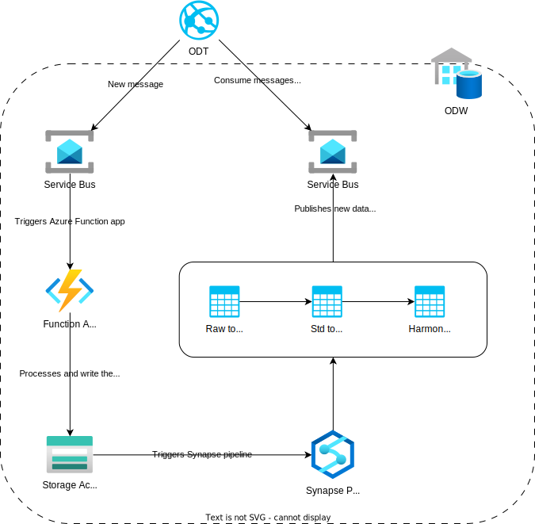
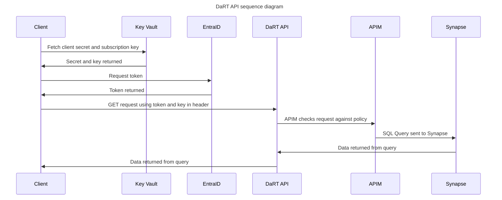

# Documentation of the use of API Management (APIM) and Function Apps with ODW  

[High level architecture](#high-level-architecture)  
[Service User process](#service-user-process)  
[DaRT process](#dart-process)  
[Folder structure example](#folder-structure-example)  
[Authorisation flow](#authorisation-flow)

## High level architecture  

  

## Key points to note

- All Function Apps will be on a Premium plan (e.g. EP1) to allow VNET integration
- All Function Apps will use the same App Service Plan
- A system assigned managed identity will be created for each Function App
- All Function Apps will be imported into API Management (APIM) service for security
- APIs will be organised into logical products within APIM
- Subscription keys will be required for all APIs
- oAuth will also be used to authenticate against each API
- A JWT validate policy will be applied to all APIs as part of auth flow
- Azure Key Vault will be used to store subscription keys and service principal secrets used to call the APIs
- Subscription keys and SPN secrets to be rotated on a regular basis (tbc) using Azure DevOps pipeline
- Clients to fetch keys as needed from Key Vault (key rotation process to be finalised and tested)

## Service User process  



## DaRT process  

 - Managed identity is created for DaRT Function App
 - Managed identity is granted read access to relevant objects in Synapse that it needs to query. This can be done within Synapse itself, e.g.  

 ```sql
-- create a login first for the managed identity
use master;
create login [pins-dart-app] from external provider;
print 'login created'

-- create a user on the required database (or multiple)
use odw_curated_db;
create user [pins-dart-app] for login [pins-dart-app];
print 'user created';

-- add the user to a role
ALTER ROLE db_datareader
ADD MEMBER [pins-dart-app];
print 'user added to role';
 ``` 
- Managed identity need read access to files in the storage account container holding the data. E.g. for the odw_curated_db it would be **pinsstodwdevuks9h80mb/odw_curated** with permission role assignment of **Storage Blob Data Reader**  
- The DaRT app is based on an http trigger with a SQL binding.  
    1. Client makes GET request to endpoint
    2. Function App receives request and sends SQL query to Synapse
    3. Synapse returns response in json format for client to consume

The app code will look something like this, using python v2 programming model. The SQL query can be held in a separate file ease of management; this is just an initial example.   

```python

import azure.functions as func
import logging
from azure.functions.decorators.core import DataType
import json

app = func.FunctionApp()

@app.function_name(name="GetCases")
@app.route(route="getcases", methods=["get"], auth_level=func.AuthLevel.FUNCTION)

@app.generic_input_binding(arg_name="cases", type="sql",
                        CommandText="SELECT TOP (10) * FROM [odw_harmonised_db].[dbo].[casework_case_info_dim]",
                        CommandType="Text",
                        ConnectionStringSetting="SqlConnectionString",
                        data_type=DataType.STRING)

def get_cases(req: func.HttpRequest, cases: func.SqlRowList) -> func.HttpResponse:
    rows = list(map(lambda r: json.loads(r.to_json()), cases))

    return func.HttpResponse(
        json.dumps(rows),
        status_code=200,
        mimetype="application/json"
    )
```

 ## Folder structure example

Function App code and required files should be placed in a folder structure as follows, within the ODW-Service repo root folder.  

Terraform can then reference the required files to create the Function Apps. 

```bash

functions:.
├───DaRT
│       .funcignore
│       dart_query.sql
│       function_app.py
│       host.json
│       local.settings.json
│       requirements.txt
│
├───ODT
└───Service_User
```

## Authorisation flow  

