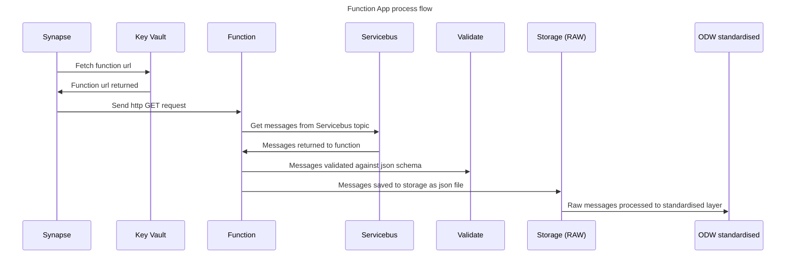
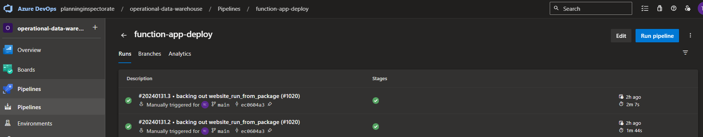
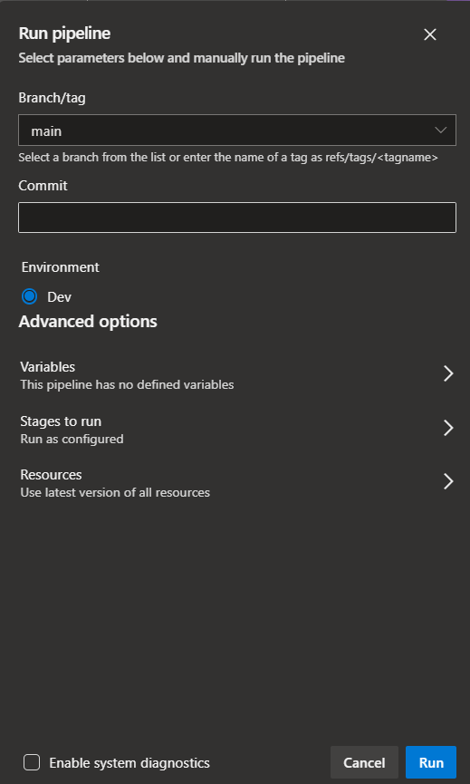
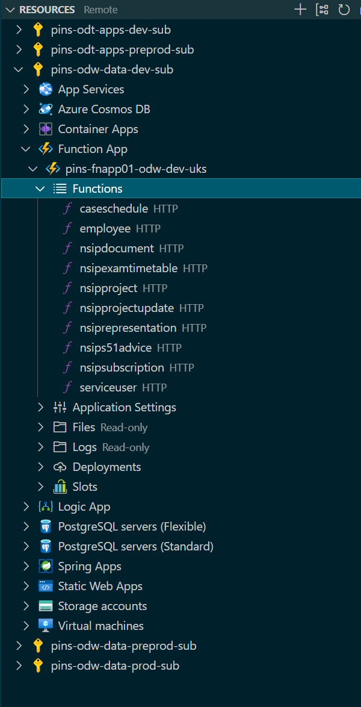
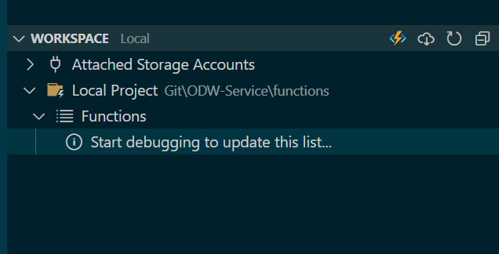
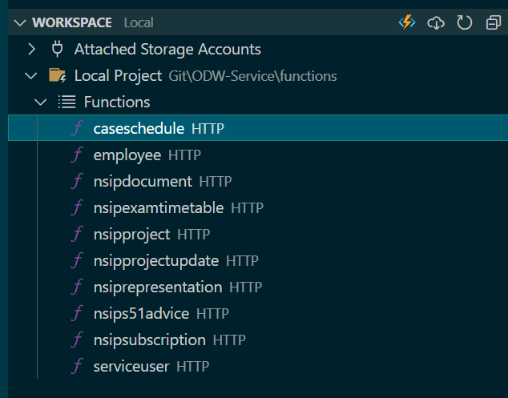
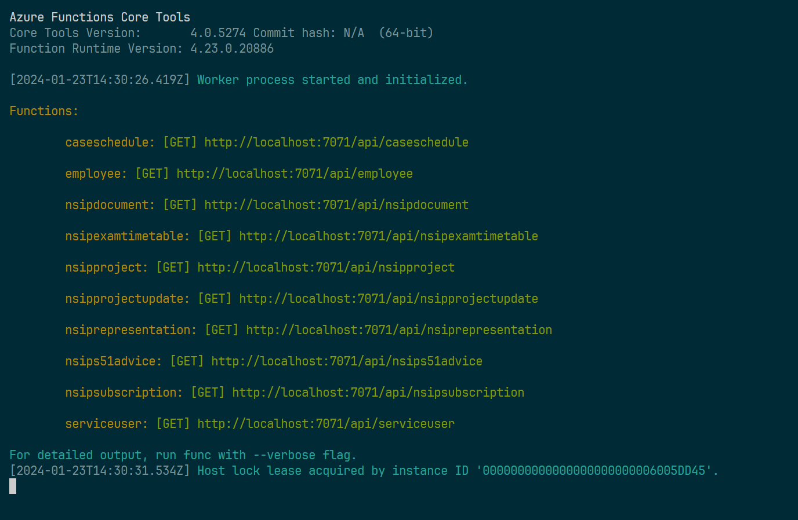
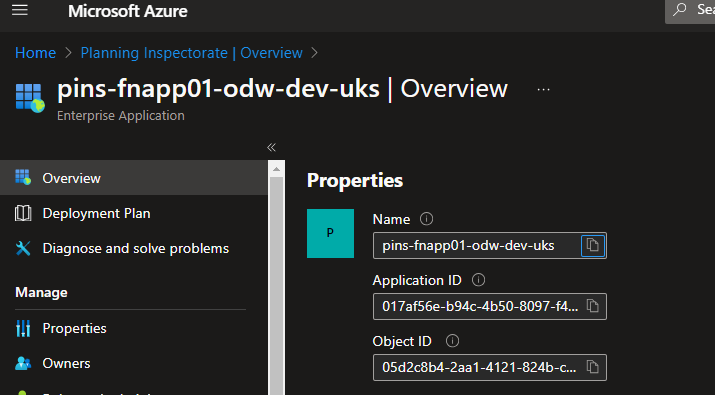
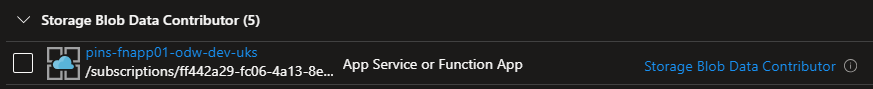
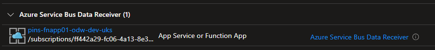

# Documentation of the use of Azure Function Apps to receive and process messages from Azure Servicebus  

[High level architecture](#high-level-architecture)  
[Functions folder structure](#functions-folder-structure)  
[Description of code](#description-of-code)  
[Process flow](#process-flow)  
[Function app - how it works](#function-app---how-it-works)  
[Dependencies](#dependencies)  
[Pydantic and json schemas](#pydantic-and-json-schemas)  
[Change process](#change-process)  
[Unit tests](#unit-tests)  
[Deployment](#deployment)  
[Local setup](#local-setup)  
[Terraform](#terraform)  
[Function App Permissions](#function-app-permissions)  
[Issues](#issues)   
[User Accessible APIs](#user-accessible-apis)  
- [DaRT API](#dart-api)  
- [Timesheet API](#timesheet-api)  

## High level architecture  

  

## Functions folder structure

Source code Github location:  
https://github.com/Planning-Inspectorate/ODW-Service/tree/main/functions

```bash
functions/
    .funcignore
    config.yaml
    deploy.sh
    function_app.py
    helper/
        datamodel-codegen.sh
        getfunctionurlsandsetkeyvaultsecrets.py
    host.json
    local.settings.json
    requirements.txt
    servicebus_funcs.py
    set_environment.py
    tests/
        config.yaml
        config_test.ipynb
        servicebus_funcs.py
        set_environment.py
        test_http_calls.py
        test.ipynb
        validate_messages.py
        validate_test.ipynb
        var_funcs.py
    validate_messages.py
    var_funcs.py
```

## Description of code

| **File**                                | **Description**                                                                                                                       |
|-----------------------------------------|---------------------------------------------------------------------------------------------------------------------------------------|
| config.yaml                             | Config file listing variables for dev, preprod and prod environments, global variables and servicebus message entities.               |
| deploy.sh                               | Shell script for manual deployments of the function app. Just comment out the environments you don't need.                            |
| function_app.py                         | The main function app code with all the functions. One function per servicebus topic.                                                 |
| helper/                                 | Folder for other useful code, e.g. the two below.                                                                                     |
| datamodel-codegen.sh                    | Shell script to generate pydantic models from json schemas. Replaced by code in the data-model repo.                                  |
| getfunctionurlsandsetkeyvaultsecrets.py | Code to extract all functions in a given function app and list their urls and put them into keyvault as secrets.                      |
| host.json                               | Mandatory file for function apps.                                                                                                     |
| local.settings.json                     | Mandatory file for function apps.                                                                                                     |
| requirements.txt                        | Required python packages for the function app.                                                                                        |
| servicebus_funcs.py                     | Functions to read servicebus messages and send them to storage. Additional functions needed by the function app can be stored here.   |
| set_environment.py                      | Code to set the environment (dev, preprod, prod) for manual deployments and to load the config file used in the function_app.py code. |
| tests/                                  | Folder for random testing files and unit tests                                                                                        |
| validate_messages.py                    | Functions to validate servicebus messages against a json schema with an ISO-8601 format checker.                                      |
| var_funcs.py                            | Other python variables and functions used as config, e.g. setting current time and date for file paths.                               |

## Process flow


## Function app - how it works

The Azure Functions python developer guide can be found here so this document will not cover all aspects of this to avoid unnecessary repetition but will cover the key specific features that relate to this implementation for PINS and the consumption of Servicebus messages from ODT.  

[Azure Functions python developer guide](https://learn.microsoft.com/en-us/azure/azure-functions/functions-reference-python?tabs=asgi%2Capplication-level&pivots=python-mode-decorators)  

The architecture initially uses 1 function app with 1 app service plan containing multiple functions. Each function performs the same task but each one reads messages from a different Servicebus topic in the ODT Servicebus namespace. The code looks as follows:  

**function_app.py**

```python
"""
Azure Function code to read messages from Azure Service Bus and send them to Azure Storage
"""

import azure.functions as func
from servicebus_funcs import get_messages_and_validate, send_to_storage
from set_environment import current_config, config
from var_funcs import CREDENTIAL
from pins_data_model import load_schemas

_STORAGE = current_config["storage_account"]
_CONTAINER = current_config["storage_container"]
_CREDENTIAL = CREDENTIAL
_NAMESPACE = current_config["servicebus_namespace_odt"]
_MAX_MESSAGE_COUNT = config["global"]["max_message_count"]
_MAX_WAIT_TIME = config["global"]["max_wait_time"]
_SUCCESS_RESPONSE = config["global"]["success_response"]
_VALIDATION_ERROR = config["global"]["validation_error"]
_SCHEMAS = load_schemas.load_all_schemas()["schemas"]

_app = func.FunctionApp()

@_app.function_name("serviceuser")
@_app.route(route="serviceuser", methods=["get"], auth_level=func.AuthLevel.FUNCTION)
def serviceuser(req: func.HttpRequest) -> func.HttpResponse:

    """
    Azure Function endpoint for handling HTTP requests.

    Args:
        req: An instance of `func.HttpRequest` representing the HTTP request.

    Returns:
        An instance of `func.HttpResponse` representing the HTTP response.
    """

    _SCHEMA = _SCHEMAS["service-user.schema.json"]
    _TOPIC = config["global"]["entities"]["service-user"]["topic"]
    _SUBSCRIPTION = config["global"]["entities"]["service-user"]["subscription"]

    try:
        _data = get_messages_and_validate(
            namespace=_NAMESPACE,
            credential=_CREDENTIAL,
            topic=_TOPIC,
            subscription=_SUBSCRIPTION,
            max_message_count=_MAX_MESSAGE_COUNT,
            max_wait_time=_MAX_WAIT_TIME,
            schema=_SCHEMA,
        )
        _message_count = send_to_storage(
            account_url=_STORAGE,
            credential=_CREDENTIAL,
            container=_CONTAINER,
            entity=_TOPIC,
            data=_data,
        )
        return func.HttpResponse(f"{_SUCCESS_RESPONSE} - {_message_count} messages sent to storage", status_code=200)

    except Exception as e:
        return (
            func.HttpResponse(f"Validation error: {str(e)}", status_code=500)
            if f"{_VALIDATION_ERROR}" in str(e)
            else func.HttpResponse(f"Unknown error: {str(e)}", status_code=500)
        )
```

A config file and other modules are imported and constants are set which can be used by all functions within the function app. Each function is an http triggered function which means it has a url / route which can be called from anywhere externally using http GET. The name of each function cannot have "-" or "_" but roughly translates to the Servicebus topic it relates to, e.g. function = "serviceuser", topic = "service-user". The config file contains these mappings.  

Each function differentiates itself further by referencing the relevant json schema, topic and subscription as shown here:  

```python
    _SCHEMA = _SCHEMAS["service-user.schema.json"]
    _TOPIC = config["global"]["entities"]["service-user"]["topic"]
    _SUBSCRIPTION = config["global"]["entities"]["service-user"]["subscription"]
```

The majority of the code is generic however and where possible is held elsewhere in external modules. Each function performs the following tasks: 

1. Receive messages from the Servicebus topic via a subscription when triggered by an http GET request.
2. Validate those messages agsinst a json schema held in the date-model repo.
3. If validation succeeds, send the messages as a json file to ODW RAW layer in Azure storage and "complete" the message (deletes it from the subscription).
4. If validation fails the messages get "abandoned" and moved to the dead letter queue to await further processing if need be.  

**servicebus_funcs.py**

This file contains the functions that perform the tasks of receiving Servicebus messages, validating them and sendiing them to ODW RAW layer in storage.  

```python
def get_messages_and_validate(
    namespace: str,
    credential: DefaultAzureCredential,
    topic: str,
    subscription: str,
    max_message_count: int,
    max_wait_time: int,
    schema,
) -> list | str:
```
```python
def send_to_storage(
    account_url: str,
    credential: DefaultAzureCredential,
    container: str,
    entity: str,
    data: list[list | dict],
) -> int:
```
**validate_messages.py**

This contains functions to validate Servicebus messages against the relevant json schema. The validate_data function is called from get_messages_and_validate above.    

```python
def is_iso8601_date_time(instance):

    """
    Function to check if a date matches ISO-8601 format
    """

    try:
        parse_date(instance)
        return True
    except ParseError:
        return False

def validate_data(data: list, schema: dict) -> list:

    """
    Function to validate a list of servicebus messages.
    Validation includes a format check against ISO-8601.
    """
    
    format_checker = FormatChecker()
    format_checker.checks("date-time")(is_iso8601_date_time)

    success = True

    for message in data:
        try:
            validate(instance = message, schema = schema, format_checker = format_checker)
        except ValidationError as e:
            print(e)
            success = False
            raise e
    return data if success else []
```

**deploy.sh**

LEGACY - pipeline is now available `function-app-deploy`  

This is a simple, temporary, shell script to deploy the function app code to the existing function app in Azure. This is to be replaced by an Azure DevOps pipeline in the near future.  

```bash
func azure functionapp publish $function_app_dev --subscription $subscription_dev
```

## Dependencies

The requirements.txt file contains various python packages that the function app needs. In addition there is a dependency on the central repo that contains the json schemas that Servicebus messages should adhere to and which are used for validation. These schemas can be imported as a dependency as follows:  

This is added to requirements.txt  
git+https://github.com/Planning-Inspectorate/data-model@main#egg=pins_data_model  

And it can then be imported and used like this:  

```python
from pins_data_model import load_schemas
...
...
...
_SCHEMAS = load_schemas.load_all_schemas()["schemas"]
```

And in each function the schema can be set as follows:  

```python
_SCHEMA = _SCHEMAS["service-user.schema.json"]
```

**var_funcs.py**

This is used to contain variables that can't easily be held in the main config.yaml file. The config.yaml file is language agnostic but var_funcs.py contains a couple of python functions whose return values are used by the function app, for example to set the current date and time that the function gets called to be used in the file path of the json file sent to Azure storage.  

```python
def current_time():
    return (
        datetime.datetime.now(datetime.timezone.utc)
        .replace(tzinfo=datetime.timezone.utc)
        .isoformat()
    )


def current_date():
    return datetime.datetime.now().strftime("%Y-%m-%d")
```

These are imported and used in the send_to_storage function so that the date and time are set when the function is called and not when the function app is deployed or restarted which will be different.  

```python
    from var_funcs import current_date, current_time

    _CURRENT_DATE = current_date()
    _CURRENT_TIME = current_time()
    _FILENAME = f"{entity}/{_CURRENT_DATE}/{entity}_{_CURRENT_TIME}.json"
```

## Pydantic and json schemas

The data-model repo contains the json schemas which are managed here centrally and also the pydantic models generated from those schemas.  

[json schemas](https://github.com/Planning-Inspectorate/data-model/tree/main/schemas)  
[Pydantic models](https://github.com/Planning-Inspectorate/data-model/tree/main/pins_data_model/models)  

Pydantic models were initially being used to validate the Servicebus messages against the model and offered a few advantages to those familiar with python and use of type hints. However, because the json schemas are the ones being the single source of truth and having to generate pydantic models every time the schema changed it was deemed easier to remove the dependency on pydantic for this purpose and validate messages just using the json schemas, as shown above in validate_messages.py.  

For reference, one issue we found when using datamodel-codegen to generate the pydantic models from the json schemas was the conversion of "date-time" formatted fields in json to "AwareDateTime" in pydantic. AwareDateTime requires timezone info to always be present in the date format but we wanted the flexibility to allow a date with or without a timezone offset. The current method allows that.  

## Change process

3 scenarios will be outlined below:  

1. Adding a new "entity" or function  
2. Amending existing functions
3. Removing a function

#### Adding a new "entity" or function

1. Add the new entity name, Servicebus topic and subscription to config.yaml as per the existing ones
2. In function_app.py copy lines 23-65 and paste at the bottom to create a new function
3. Amend the @_app.function_name, @_app.route, function name, schema, topic and subscription accordingly

#### Amending existing functions

1. In config.yaml amend the topic or subscription as needed
2. In function_app.py amend the variables accordingly depending on the change to the config file

#### Removing a function

1. In config.yaml, remove the entity
2. In function_app.py, remove the function, being careful not to delete part of any other function

#### Deploy changes

When developing locally, use Azure Functions Core Tools to check if the functions still work. Documentation on the use of Azure Functions Core Tools is out of scope of this guide.  

To deploy manually (before DevOps pipeline is ready) do the following:  

1. Set the environment in the set_environment.py file on line 19 to either "dev", "preprod" or "prod". Deploy to dev first obviously. Save the file.

```python
CURRENT_ENVIRONMENT = "dev"
```
2. In deploy.sh, make sure the dev deployment line is uncommented and the preprod and prod lines are commented out, e.g. line 12 below will deploy to dev. To deploy to preprod uncomment out line 13 and for prod line 14, each time makign sure only one of them is uncommented.  

```bash
func azure functionapp publish $function_app_dev --subscription $subscription_dev
```
## Unit tests

A test file can be found here:  

**functions/tests/test_http_calls.py**

This contains tests for the function urls. The urls are listed and a separate test is executed for each url. The listed urls are the localhost urls for testing locally. Changing these to actual function urls will also work but bear in mind the function urls contain a function code appended to them and they're stored in KeyVault for this reason. These should not appear in code in Github. If you want a list of all the actual function urls you can extract those using this file **functions/helper/getfunctionurlsandsetkeyvaultsecrets.py**

To run the tests, make sure you have your vitual environment activated and have installed the dependencies in requirements.txt, which includes pytest. In a terminal run the following command from the tests directory:  

```bash
python -m pytest -v test_http_calls.py -s --tb=line
```
The -s parameter prints out any print statement to the terminal and --tb=line makes sure only a simple one line traceback is printed in the pytest output.  

## Deployment

An Azure DevOps pipeline has been created to deploy function app code to the existing function app in Azure.  

Pipeline: [function-app-deploy Azure DevOps](https://dev.azure.com/planninginspectorate/operational-data-warehouse/_build?definitionId=170)  

The pipeline essentially performs a few simple steps outlined below. The full code can be found at the link above in Azure DevOps or in Github here - [function-app-deploy Github](https://github.com/Planning-Inspectorate/ODW-Service/blob/main/pipelines/function_app_deploy.yaml)

1. Create an archive zip file of the code to deploy to the function app  

```yaml
# Switch to functions directory and create a file containing a list of all files in the top level folder.
  - script: |

      cd $(Build.SourcesDirectory)/functions
      find . -maxdepth 1 -type f | sed 's|^\./||' > $(Build.SourcesDirectory)/functions/filelist.txt

    displayName: 'Creating top level files list'

# Create a zip file of all the files in the filelist.
  - script: |

        cd $(Build.SourcesDirectory)/functions
        cat $(Build.SourcesDirectory)/functions/filelist.txt | xargs zip -r $(Build.ArtifactStagingDirectory)/functions.zip

    displayName: 'Archive top level files'
```

2. Publish the zip file as an artifact to be used further in the pipeline  

```yaml
# Publish the zip file as an artifact to be used further in the pipeline.
  - task: PublishBuildArtifacts@1
    displayName: 'Publish build artifact'
    inputs:
      PathtoPublish: '$(Build.ArtifactStagingDirectory)'
      ArtifactName: 'FunctionCode'
```

3. Download the zip file artifact and deploy it to the function app  

```yaml
# Job to deploy the zip file to an existing Azure Function App.
- job: DeployToAzureFunctions
  displayName: 'Deploy to Azure Functions'
  dependsOn: BuildAndPackage
  
  steps:

# Download the artifact first - the zip file.
  - task: DownloadBuildArtifacts@1
    displayName: 'Download build artifact'
    inputs:
      buildType: 'current'
      artifactName: 'FunctionCode'
      downloadPath: '$(System.ArtifactsDirectory)'

# Use the Azure CLI to deploy the zip file to the Function App in Azure.
  - task: AzureCLI@2
    displayName: 'Deploy to function app'
    inputs:
      azureSubscription: '$(armServiceConnectionName)'
      scriptType: 'bash'
      scriptLocation: 'inlineScript'
      inlineScript: |
        az functionapp deployment source config-zip --resource-group $(resourceGroup) --name $(functionApp) --src $(zipFile)
```

This pipeline is triggered by any change to the function app code in the **functions** top level folder that gets merged with the main branch. The pipeline currently deploys to Dev only but will be changed soon to sequentially deploy to Test and Prod as well.  

To run the pipeline manually just go to Azure DevOps here [function-app-deploy](https://dev.azure.com/planninginspectorate/operational-data-warehouse/_build?definitionId=170&_a=summary) and click **Run pipeline**.  

  

Select the branch you want to run from and the environment. When testing this would be your feature branch but otherwise the main branch. This may change once it's amended to deploy to 3 environments sequentially.  



## Local setup

There is guidance online about setting up your device to work with Azure Functions locally. I will attempt to outline the main tasks here.  

1. Read this guidance as the specifics are likely to change over time and it's best to follow official guideance where possible rather than my interpretation - [Azure Functions python developer guide](https://learn.microsoft.com/en-us/azure/azure-functions/functions-reference-python?tabs=asgi%2Capplication-level&pivots=python-mode-decorators)

2. When using VS Code, open the functions folder in its own workspace. If the Azure Functions core tools detect more than one function_app.py in the workspace then it won't work properly. If you have more than one function app then each one must be opened in a different workspace. You can work on the code all in one workspace but the individual workspaces are needed for testing purposes.    

3. Install the VS Code Azure extension. This will enable you to login and see resources in VS Code as shown here.  

  

4. If a function app is found in the workspace you'll see this in the bottom left in VS Code  

  

Which will then show the functions once it's debugged  

  

5. Make sure to start the Azure storage emulator as per Microsoft guideance  

6. Debugging will start a local function app emulator. Dependencies listed in requirements.txt will be installed to a virtual environment which gets created automatically for this purpose. The functions in the function app will then be listed in the terminal with the localhost urls.  

  

7. You can then call these urls however you wish to test, e.g. using tests/test_http_calls as documented above in the Unit test section.  

**NB: remember that the function app is running locally but any code that exists inside the functions will be run as normal, i.e. you make a GET request to the localhost url but the function code is still receiving Servicebus messages from a namespace in Azure. This is fine but bear in mind any permissions needed for your personal account to test what the function does.**  

## Terraform

The function app, like any other infrastructure, is created using Terraform. The function app Terraform code can be found in Github here:  

[Function app Terraform code](https://github.com/Planning-Inspectorate/ODW-Service/tree/main/infrastructure/modules/function-app)

## Function App Permissions

There are some permissions needed by the function app to work. These are outlined below.  

1. A system assigned managed identity is created for the function app when it is created by Terraform. The Dev identity looks like this.  

  

2. The app is then granted **Storage Blob Data Contributor** role on the storage account where it is writing data to the RAW layer. This is the account used by Synapse.

    Account (Dev): pinsstodwdevuks9h80mb  

  

3. The app is then granted **Azure Service Bus Data Receiver** role on the Service Bus namespace which it needs to read data from. In this case it's the ODT namespace.  

    Namespace: pins-sb-back-office-dev-ukw-001  

  

## User permissions

**Azure Devops**

In Azure DevOps you need to be added to the following group:  

Project: operational-data-warehouse  
Team: operational-data-warehouse Team

**Azure**

In Azure, standard data engineer permissions should suffice. Deployment of changes are done via an Azure DevOps pipeline so you should not need to run deployments from your own device. Testing the function app locally is covered under the local setup section.  

## Issues

One issue you may come across is if you deploy the function app code using different deployment methods to the same function app. The current app code has been deployed using zip deploy via the Azure DevOps pipeline using an Azure CLI script, as shown below.  

```bash
az functionapp deployment source config-zip --resource-group $(resourceGroup) --name $(functionApp) --src $(zipFile)
```

If you try to deploy using an Azure DevOps pipeline task, i.e. AzureFunctionApp@2, this may cause an issue where the functions become disabled and will no longer be visible in the portal and will not be able to be called via a GET request.  

[AzureFunctionApp@2](https://learn.microsoft.com/en-us/azure/devops/pipelines/tasks/reference/azure-function-app-v2?view=azure-pipelines)  

Therefore it is best to stick to the same deployment method for an existing app. Documentation from Microsoft is available online for various situations that you may come across in this case.  

# User Accessible APIs

Various parts of the business want to be able to query the ODW database tables from UIs and as such, the function app approach has been used.

## DaRT API
### Goal
Back Office (ODT) wants to read data from ODW. An API needs to be provided which reads data from specified SQL tables and returns it to the calling process.

### Process

To simply things, the code exists within the service bus functions **functions/function_app.py** file. This makes deploying and maintaining it easier

```python
@_app.function_name(name="getDaRT")
@_app.route(route="getDaRT", methods=["get"], auth_level=func.AuthLevel.FUNCTION)
@_app.sql_input(arg_name="dart",
                command_text="""
                SELECT *
                FROM odw_curated_db.dbo.dart_api
                WHERE UPPER([applicationReference]) = UPPER(@applicationReference) 
                OR UPPER([caseReference]) = UPPER(@caseReference)
                """,
                command_type="Text",
                parameters="@caseReference={caseReference},@applicationReference={applicationReference}",
                connection_string_setting="SqlConnectionString"
                )
def getDaRT(req: func.HttpRequest, dart: func.SqlRowList) -> func.HttpResponse:
    try:
        rows = []
        for r in dart:
            row = json.loads(r.to_json())
            for key, value in row.items():
                if isinstance(value, str):
                    try:
                        parsed_value = json.loads(value)
                        row[key] = parsed_value
                    except json.JSONDecodeError:
                        row[key] = "Invalid json"
                        print(f"Failed to parse field '{key}': {value}\nError: {e}")
            rows.append(row)
        return func.HttpResponse(
            json.dumps(rows),
            status_code=200,
            mimetype="application/json"
        )
    except Exception as e:
        return func.HttpResponse(f"Unknown error: {str(e)}", status_code=500)
``` 

This function exposes an endpoint which can be called from external applications.

The URL looks a little like this:

```https://<FUNCTION_APP_URL>/api/getDaRT?code=<ACCESS_TOKEN>==&applicationReference=<APPLICATION_REFERENCE>&caseReference=<CASE_REFERENCE>```

```<APPLICATION_REFERENCE>``` is expected to be a string to match against the column applicationReference. The sql_input decorator protects against SQL injection.  

```<CASE_REFERENCE>``` is expected to be a string to match against the column caseReference. The sql_input decorator protects against SQL injection.  

CORS headers are returned which means that Web UIs from other origins can access the API.


## Timesheet API
### Goal
Back Office (ODT) wants to read data from ODW. An API needs to be provided which reads data from specified SQL tables and returns it to the calling process.

### Process

To simply things, the code exists within the service bus functions **functions/function_app.py** file. This makes deploying and maintaining it easier

```python
@_app.function_name(name="gettimesheets")
@_app.route(route="gettimesheets", methods=["get"], auth_level=func.AuthLevel.FUNCTION)
@_app.sql_input(arg_name="timesheet",
                command_text="SELECT [caseReference], [applicationReference], [siteAddressLine1], [siteAddressLine2], [siteAddressTown], [siteAddressCounty], [siteAddressPostcode] FROM [odw_curated_db].[dbo].[appeal_has] WHERE UPPER([caseReference]) LIKE Concat(Char(37), UPPER(@searchCriteria), Char(37)) OR UPPER([applicationReference]) LIKE Concat(Char(37), UPPER(@searchCriteria), Char(37)) OR UPPER([siteAddressLine1]) LIKE Concat(Char(37), UPPER(@searchCriteria), Char(37)) OR UPPER([siteAddressLine2]) LIKE Concat(Char(37), UPPER(@searchCriteria), Char(37)) OR UPPER([siteAddressTown]) LIKE Concat(Char(37), UPPER(@searchCriteria), Char(37)) OR UPPER([siteAddressCounty]) LIKE Concat(Char(37), UPPER(@searchCriteria), Char(37)) OR UPPER([siteAddressPostcode]) LIKE Concat(Char(37), UPPER(@searchCriteria), Char(37))",
                command_type="Text",
                parameters="@searchCriteria={searchCriteria}",
                connection_string_setting="SqlConnectionString")
def gettimesheets(req: func.HttpRequest, timesheet: func.SqlRowList) -> func.HttpResponse:
    """
    We need to use Char(37) to escape the % 
    https://stackoverflow.com/questions/71914897/how-do-i-use-sql-like-value-operator-with-azure-functions-sql-binding
    """
    try:
        rows = list(map(lambda r: json.loads(r.to_json()), timesheet))
        return func.HttpResponse(
            json.dumps(rows),
            status_code=200,
            mimetype="application/json"
        )
    except Exception as e:
        return (
            func.HttpResponse(f"Unknown error: {str(e)}", status_code=500)
        )
``` 

This function exposes an endpoint which can be called from external applications.

The URL looks a little like this:

```https://<FUNCTION_APP_URL>/api/gettimesheets?code=<ACCESS_TOKEN>==&searchCriteria=<SEARCH CRITERIA>```

```<SEARCH_CRITERIA>``` is expected to be a free text string which is resolved to ```%<SEARCH_CRITERIA>%``` internally and searches across the following columns. The sql_input decorator handles SQL injection protection.

```
[caseReference],
[applicationReference],
[siteAddressLine1],
[siteAddressLine2],
[siteAddressTown],
[siteAddressCounty],
[siteAddressPostcode]
```

CORS headers are returned which means that Web UIs from other origins can access the API.

#### Notes

For now, we use the LIKE and UPPER operands to give a wildcard search. You cannot combine the % operand and the @searchCriteria parameter so we have to work around it by uaing a CONCAT and the Char(37) (which is %) to reproduce this functionality.


To make use of the **sql_input** declarator (which is defined here 
[here](https://learn.microsoft.com/en-us/azure/azure-functions/functions-bindings-azure-sql-input?tabs=isolated-process%2Cnodejs-v4%2Cpython-v2&pivots=programming-language-python)), the requirements.txt has needed to be updated to use a later version of ***azure-functions***
```
azure-identity==1.15.0
azure-functions==1.20.0
azure-servicebus==7.11.4
azure-storage-blob==12.19.0
azure-mgmt-web==7.2.0
azure-keyvault==4.2.0
PyYAML==6.0.1
jsonschema==4.20.0
iso8601==2.1.0
aiohttp==3.9.4
pytest==7.4.0
pytest-asyncio==0.23.3
git+https://github.com/Planning-Inspectorate/data-model@main#egg=pins_data_model
```
If the previous version 1.17.0 was used then the functions app deployed but zero functions were available with no apparent logging as to the cause.

### Functionality
This function simply  makes a query to the curated table [odw_curated_db].[dbo].[s62a] which surfaces the required data. The function app needs to have the right permissions to make these queries which uses a SqlConnectionString variable in the function app configuration

```SqlConnectionString: Server=tcp:<SQL INSTANCE>,1433;Persist Security Info=False;MultipleActiveResultSets=False;Encrypt=True;TrustServerCertificate=False;Database=odw_curated_db;Authentication=Active Directory Managed Identity;",```

The SQL permissions are created in a similar way to [DaRT process](#dart-process)
