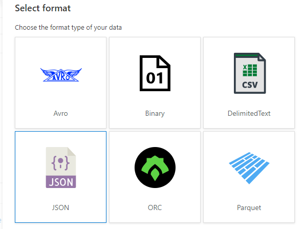

# Standards for ingesting data from external APIs into ODW RAW layer

Further Microsoft documentation can be found here - [Copy and transform data from and to a REST endpoint by using Azure Data Factory](https://learn.microsoft.com/en-us/azure/data-factory/connector-rest?tabs=data-factory)  

| Steps         |Link                                               |  
| :------------|:-------------------------------------|  
| Step 1        | [Create linked service to source data](#1-create-linked-service-to-source-data)                                       |  
| Step 2        | [Add copy data task to pipeline and provide a name and description in the General tab](#2-add-copy-data-task-to-pipeline-and-provide-a-name-and-description-in-the-general-tab)                                                       |  
| Step 3        |[Create source dataset based on linked service](#3-create-source-dataset-based-on-linked-service-specifying-relative-url-and-parameters-if-the-dataset-already-exists-then-just-select-from-the-dropdown-otherwise-select-new-and-create-one-in-the-next-screen)                                                         |  
| Step 4        | [Configure source dataset by adding relative url](#4-configure-source-dataset-by-adding-relative-url)                                                        |  
| Step 5        | [Define pagination rules for API call](#5-define-pagination-rules-for-api-call-this-depends-on-the-api-definition-of-whichever-api-youre-calling-so-you-need-to-refer-to-their-specific-documentation-or-view-the-results-of-an-api-call-to-see-what-is-needed-here-the-example-below-is-for-zendesk)                                                      |  
| Step 6        | [Configure Sink dataset (create new if need be)](#6-configure-sink-dataset-create-new-if-need-be)                                                        |  
| Step 7        | [Add a logging notebook](#7-finally-in-the-pipeline-add-a-logging-notebook-for-when-the-copy-data-task-fails-as-shown-below-the-logging-notebook-is-py_fail_activity_logging)                                                       |  
 

#### 1. Create linked service to source data  

   

Zendesk linked service json example  

```json
{
    "name": "ls_zendesk_custom",
    "properties": {
        "annotations": [],
        "type": "RestService",
        "typeProperties": {
            "url": "https://pinssupport.zendesk.com/api/v2/",
            "enableServerCertificateValidation": true,
            "authenticationType": "Basic",
            "userName": "svc_zendesk@planninginspectorate.gov.uk",
            "password": {
                "type": "AzureKeyVaultSecret",
                "store": {
                    "referenceName": "ls_kv",
                    "type": "LinkedServiceReference"
                },
                "secretName": "zendesk-service-password"
            }
        },
        "connectVia": {
            "referenceName": "AutoResolveIntegrationRuntime",
            "type": "IntegrationRuntimeReference"
        }
    }
}
```

#### 2. Add copy data task to pipeline and provide a name and description in the General tab.    


#### 3. Create source dataset based on linked service, specifying relative url and parameters. If the dataset already exists then just select from the dropdown, otherwise select "new" and create one in the next screen.  

  

Create new dataset and select "REST". Then give it a name and select a linked service to use in the next page - the linked service created in step 1.  


#### 4. Configure source dataset by adding relative url.  

  

#### 5. Define pagination rules for API call. This depends on the API definition of whichever API you're calling so you need to refer to their specific documentation or view the results of an API call to see what is needed here. The example below is for Zendesk.  

  

```json
 "next_page": "https://pinssupport.zendesk.com/api/v2/tickets.json?page=2",
    "previous_page": null,
    "count": 8393
```
As you can see there is a next_page key in the results of the call so if this has a value then you need to send a request to the next page url to retrieve the next page of data. If this value is null then no more data is available. In the Synapse Copy Data task above, you set the AbsoluteUrl Body to next_page and tell it to stop looking for more data by specifying the EndCondition next_page to empty.  

#### 6. Configure Sink dataset (create new if need be).  

  

As in step 3 for the source dataset, if one exists then select it from the dropdown, otherwise create a new one in the same way as previously. In this case we're selecting Azure Data Lake Storage Gen2.  

  

Then select the file format as below.  

  

In the sink tab, specify the file pattern - for json files either "array of objects" or "set of objects".  

The other tabs, "mapping", "settings" and "user properties" can be used if need be, depending on use case. Refer to Microsoft documentation for details on those.   

#### 7. Finally, in the pipeline, add a logging notebook for when the copy data task fails, as shown below. The logging notebook is "py_fail_activity_logging".   


