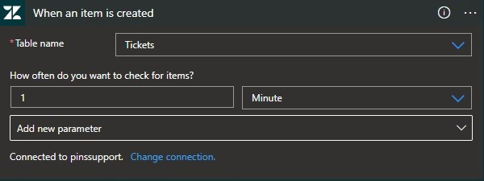
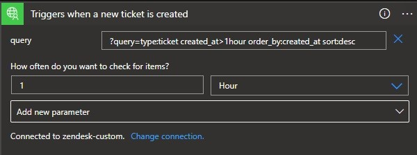

# PINS Azure Logic App process 

## Table of contents

[Purpose](#purpose)  
[Options](#options)  
[Limitations of the built-in Zendesk connector](#limitations-of-the-built-in-zendesk-connector)  
[Process to build a costom connector](#process-to-build-a-custom-connector)  
  - [Import Postman Collection](#import-postman-collection)  
  - [Import Open API definition file](#import-open-api-definition-file)    
  - [Defining the trigger for Logic App workflow](#defining-the-trigger-for-logic-app-workflow)  
  - [Send data to ServiceBus topic](#send-data-to-servicebus-topic)  

[Architecture diagram](#architecture-diagram)  
[Terraform](#terraform)  
[Change Process](#change-process)  
[Improvements](#improvements)

## Purpose

Azure Logic Apps are being used to schedule regular extracts of data from the Zendesk Ticket API for further processing and consumption by downstream systems and consumers.  

## Options

1. Built-in Zendesk connector - out of the box ith Logic Apps
2. Custom connector - build a custom connector ourselves

  

  

Zendesk built-in connector - [Zendesk](https://learn.microsoft.com/en-us/connectors/zendesk/)  

Creating a custom connector - [Custom connector](https://learn.microsoft.com/en-us/connectors/custom-connectors/create-logic-apps-connector)  

Example of custom connector Open API definition  

```yaml
openapi: 3.0.1
info:
  title: Zendesk custom API
  description: Custom API for Zendesk
  version: "0.1"
servers:
- url: https://pinssupport.zendesk.com
```  

## Limitations of the built-in Zendesk connector

Taken from the documentation here - [Zendesk connector limitations](https://learn.microsoft.com/en-us/connectors/zendesk/)  

>Connector returns only atomic properties of Zendesk entity (i.e. lists, records and other complex types are not supported). For instance, Ticket entity has tags property represented by array on Zendesk's side. Zendesk connector returns [List] string for such fields.
>
>Connector requires updated_at column to exist for any table that is used with triggers.
>
>Zendesk Search API has a limitation on returning 1000 results per query. This affects some connector actions, that would fail with an error ("Http request failed: the content was not a valid JSON") if target table contains 1000 records or more:

Below is an example of the missing array values returned by the built-in connector.  

```json
{
  "tags": [List]
}
```

Rather than complete data, which would be more useful, like below.  

```json
{
  "tags": [
          "tag_value_1",
          "tag_value_2",
          "tag_value_3"
          ]
}
```

**Solution = Custom Connector**  

## Architecture diagram  


## Process to build a custom connector

Step 1: Create a new custom connector resource in the subscription. Guidance can be followed here - [Custom connector](https://learn.microsoft.com/en-us/connectors/custom-connectors/create-logic-apps-connector)

Step 2: Define the custom connector.

There are two main methods to define a custom connector to be used by Logic Apps (and Power Automate).  

1. [Import Postman Collection](https://learn.microsoft.com/en-us/connectors/custom-connectors/define-postman-collection)
2. [Import Open API definition file](https://learn.microsoft.com/en-us/connectors/custom-connectors/define-openapi-definition)  

In the Azure portal, after clicking on the newly created Logic APp custom connector resource, you can click on edit and see this screen below.  

  

### Import Postman Collection

The full Zendesk public API can be viewed online in Postman here - [Postman Zendesk API](https://www.postman.com/zendesk-redback/workspace/zendesk-public-api/overview).  

The Zendesk documentation also contains this guidance - [Exploring Zendesk with Postman](https://developer.zendesk.com/documentation/api-basics/working-with-the-zendesk-apis/exploring-zendesk-apis-with-postman/)  

**NB: The concept of Postman, creating collections and how to test API requests in general is out of the scope of this documentation.**  

There are 2 main issues with using a Postman collection for this purpose:

1. The collection file size is limited to 1MB. This is quite small and means cropping the collection to the bare minimum for what you need. It wasn't a huge issue here but an awkward process and for the full Zendesk API to be utilised we'd have to have multiple small collections which would be a bit of work to achieve initially and possibly hard to update.

2. When importing the collection into the custom connector, it attempted to convert the .json file into a swagger definition. It wasn't able to achieve this very well and led to various formatting errors that were hard to understand and fix in the UI itself.  

For those reasons the Open API definition file was the best and easier option to go with.  

### Import Open API definition file

Some useful guidance at the following sites:

[Basic structure](https://swagger.io/docs/specification/basic-structure/)  
[Getting started with Open API](https://learn.openapis.org/)  
[Open API specification - Github](https://github.com/OAI/OpenAPI-Specification/)  
[Swggerhub - tool to help to build an API](https://app.swaggerhub.com/home)  
[Swagger Inspect (soon replaced by Explore)](https://inspector.swagger.io/builder)  

There is a lot of documentation online and many tools to help with creating an API definition but the ones listed above are what I have used. The alternative is to just write the definition yourself if you're comfortable doing that. A sample of the definition file is shown below.  

```yaml
openapi: 3.0.1
info:
  title: Zendesk custom API
  description: Custom API for Zendesk
  version: "0.1"
servers:
- url: https://pinssupport.zendesk.com
paths:
  /api/v2/tickets/{ticket_id}/related:
    get:
      description: Call to get related tickets
      summary: Get related tickets
      operationId: GetRelatedTickets
      parameters:
      - name: ticket_id
        in: path
        description: The ticket id if you want a specific ticket
        required: true
        style: simple
        explode: false
        schema:
          type: integer
      responses:
        "200":
          description: Auto generated using Swagger Inspector
          content:
            application/json; charset=utf-8:
              schema:
                type: string
              examples: {}
      servers:
      - url: https://pinssupport.zendesk.com
    servers:
    - url: https://pinssupport.zendesk.com
```

In order to create this file I used Swagger Inspect which is a tool that allows you to create http requests and view the results. The requests you make can then be added to a collection and grouped together and then used to create an Open API definition. This is a quick way to get a sample file structure in place which you cna add to at a later date.  

  

The API can then be viewed in Swaggerhub as below.  

  

Once confortable with what's required the file can then be edited directly in VS Code or elsewhere and version controlled.  

The Logic App Custom Connector can recognise this file without any issues so it can be used in Logic App workflows.  

### Defining the trigger for Logic App workflow

Logic App workflows require a trigger to determine what event causes the workflow to run. Our trigger in this case is defined in the Open API definition as follows:  

```yaml
  /api/v2/search.json:
    get:
      responses:
        "200":
          description: OK
          content:
            application/json; charset=utf-8:
              schema:
                type: string
              examples: {}
      summary: Triggers when a new ticket is created
      description: Triggers when a new ticket is created
      operationId: OnNewTicket
      x-ms-trigger: batch
      x-ms-trigger-metadata:
        mode: polling
        kind: query
      x-ms-trigger-hint: New ticket trigger
      parameters:
        - name: query
          in: query
          required: false
          allowReserved: true
          schema:
            type: string
            default: '?query=type:ticket created_at>1hour order_by:created_at sort:desc'
          description: Search query for latest tickets
          x-ms-visibility: none
```

The trigger can then be used in the Logic App workflows as shown below. The api call will be sent to the base url/resource/query, i.e. **pinssupport.zendesk.com/api/v2/search.json?query=type:ticket created_at>1hour order_by:created_at sort:desc**. This gets the tickets created in the last hour and can be scheduled to run on a specified interval.  

  

### Send data to ServiceBus topic

As the image above shows, once the data is received from the Zendesk API it is sent as a message to a Service Bus topic to be consumed by further processes, e.g. Synapse Analytics. The message is sent with some dynamically generated guids, the message body and a label to denote if it's a "created" ticket or "updated" ticket. More information on Service Bus can be found here - [Service Bus](https://learn.microsoft.com/en-us/azure/service-bus-messaging/service-bus-messaging-overview)  

## Terraform

As per best practice we make use of Infrastructure as Code and use Terraform to achieve this. This allows all infrastructure to be re-created easily should we need to and makes changes easier and safe. Terraform files for Logic Apps are located in the Github repo here...

/infrastructure/modules/logic-app

This document will not be a Terraform tutorial but simply point to where to look for how the Logic Apps are configured.  

**api-connections.tf**  

This file creates the Service Bus and Zendesk custom API connections. The custom connection is defined as below and takes the API credentials from KeyVault.   

```terraform
resource "azurerm_resource_group_template_deployment" "zendesk_custom_api_template" {
  count = var.logic_app_enabled ? 1 : 0

  name                = "zendesk-custom-api"
  resource_group_name = var.resource_group_name
  deployment_mode     = "Incremental"
  parameters_content = jsonencode({
    "connections" = {
      value = "zendesk-custom-api"
    }
    "customApiId" = {
      value = azapi_resource.zendesk_custom_api[count.index].id
    }
    "username" = {
      value = data.azurerm_key_vault_secret.zendesk_username.value
    }
    "password" = {
      value = data.azurerm_key_vault_secret.zendesk_password.value
    }
  })

  template_content = file("${path.module}/zendesk-template.json")
  ```

**zendesk-template.json**

*not sure where this file comes in - Alex, can you add comemnts here?*  

**api-custom-connector.tf** 
 
This provides the link to the definition of the connector, which is in zendesk-swagger.json, referenced below.  

```terraform
resource "azapi_resource" "zendesk_custom_api" {
  count = var.logic_app_enabled ? 1 : 0

  type      = "Microsoft.Web/customApis@2016-06-01"
  name      = "zendesk-custom-api"
  location  = var.location
  parent_id = var.resource_group_id
  tags      = local.tags

  body = jsonencode(
    {
      "properties" : {
        "connectionParameters" : {
          "username" : {
            "type" : "securestring",
          },
          "password" : {
            "type" : "securestring",
          }
        },
        "backendService" : {
          "serviceUrl" : "https://pinssupport.zendesk.com",
        },
        "capabilities" : [],
        "description" : "Custom API for Zendesk",
        "displayName" : "zensdesk-custom-api",
        "iconUri" : "https://content.powerapps.com/resource/makerx/static/media/default-connection-icon.00d06b6e.svg",
        "swagger" : jsondecode(file("${path.module}/zendesk-swagger.json")),
        "apiType" : "Rest",
      }
  })
}
```

**zendesk-swagger.json**

This is the API definition file. The Open API definition was written in yaml as mentioned above in this documentation but json is also supported and to make this work on Azure it requires the file to be in json format. The contents are the same, just the file format has been changed.  

```json
 {
  "swagger": "2.0",
  "info": {
    "title": "Zendesk custom API",
    "description": "Custom API for Zendesk",
    "version": "0.1"
  },
  "host": "pinssupport.zendesk.com",
  "basePath": "/",
  "schemes": [
    "https"
  ],
  "consumes": [],
  "produces": [],
  "paths": {
    "/api/v2/tickets/{ticket_id}/related": {
      "get": {
        "summary": "Get related tickets",
        "description": "Call to get related tickets",
        "operationId": "GetRelatedTickets",
        "produces": [
          "application/json; charset=utf-8"
        ],
        "parameters": [
          {
            "in": "path",
            "name": "ticket_id",
            "description": "The ticket id if you want a specific ticket",
            "required": true,
            "type": "integer"
          }
        ],
        "responses": {
          "200": {
            "description": "Auto generated using Swagger Inspector",
            "schema": {
              "type": "string"
            }
          }
        },
        "schemes": [
          "https"
        ]
      }
    }
```

The Logic App workflows are defined in the below files.  

**zendesk-created-workflow.tf**

```terraform
resource "azurerm_logic_app_trigger_custom" "zendesk_created_trigger" {
  count = var.logic_app_enabled ? 1 : 0

  logic_app_id = azurerm_logic_app_workflow.zendesk_created[count.index].id
  name         = "Triggers_when_a_new_ticket_is_Created"

  body = jsonencode({
    "evaluatedRecurrence" : {
      "frequency" : "Hour",
      "interval" : 1
    },
    "inputs" : {
      "host" : {
        "connection" : {
          "name" : "@parameters('$connections')['zendesk-custom-api']['connectionId']"
        }
      },
      "method" : "get",
      "path" : "/api/v2/search.json",
      "queries" : {
        "query" : "?query=type:ticket created_at>1hour order_by:created_at sort:desc"
      }
    },
    "recurrence" : {
      "frequency" : "Hour",
      "interval" : 1
    },
    "type" : "ApiConnection"
  })
}
```

**zendesk-updated-workflow.tf**

Identical to the created workflow but the query is looked for updated_at instead.

```terraform
      "queries" : {
              "query" : "?query=type:ticket updated_at>1hour order_by:created_at sort:desc"
            }
```

## Change process

The files above can be amended if needed through standard GitOps processes, i.e. 
1. create branch
2. make changes
3. check in branch
4. create PR
5. PR is reviewed
6. merged to main branch 
7. Azure DevOps pipeline runs to perform a ```terraform apply``` to apply changes in Azure.

## Improvements

*Add improvements here*